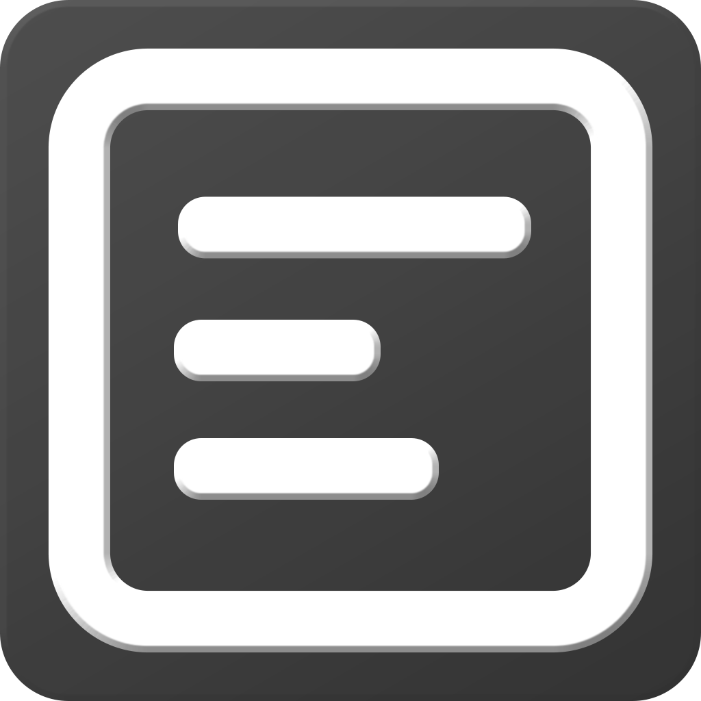

[![Contributors][contributors-shield]][contributors-url]
[![Forks][forks-shield]][forks-url]
[![Stargazers][stars-shield]][stars-url]
[![Issues][issues-shield]][issues-url]
[![GPL-3.0 License][license-shield]][license-url]
[![LinkedIn][linkedin-shield]][linkedin-url]
[![Crowdin][crowdin-shield]][crowdin-url]

<!-- PROJECT LOGO -->
 

  

  <h2 align="center">My Notes</h2>

  

    An easy to use notes and reminders app. Created with WinUI 3 and C#
     <!--
    <a href="https://github.com/othneildrew/Best-README-Template"><strong>Explore the docs »</strong></a>
     -->
    <a href="https://github.com/ErenCanUtku/MyNotes/issues">Report Bug</a>
    ·
    <a href="https://github.com/ErenCanUtku/MyNotes/issues">Request Feature</a>
  

<!-- TABLE OF CONTENTS -->

  
Table of Contents

  <ol>
    <li>
      <a href="#about-the-project">About The Project</a>
      <ul>
        <li><a href="#built-with">Built With</a></li>
      </ul>
    </li>
    <li>
      <a href="#getting-started">Getting Started</a>
      <ul>
        <!--<li><a href="#prerequisites">Prerequisites</a></li>-->
        <li><a href="#installation">Installation</a></li>
      </ul>
    </li>
    <li><a href="#usage">Usage</a></li>
    <li><a href="#roadmap">Roadmap</a></li>
    <li><a href="#contributing">Contributing</a></li>
    <li><a href="#license">License</a></li>
    <li><a href="#contact">Contact</a></li>
    <li><a href="#acknowledgments">Acknowledgments</a></li>
  </ol>

<!-- ABOUT THE PROJECT -->
## About The Project

[![Product Name Screen Shot][product-screenshot]]()

There are many note and reminder apps available on GitHub and other platforms; however, I didn't find one that combines both  of these while using a modern UI, so I created this enhanced one. I want to create a "Note App" so amazing that it'll be the last one you ever need.

Here's why:
* Sometimes life can be overwhelming, and I often forget tasks that I want to do later, now with reminders feature it's not a problem
* If you need more detailed notes than .txt file, but not too much decorated and simple enough, with notes feature it's simple but effective
* It's easier to manage all your notes and reminders in one organized place.

Of course, no one "Note App" will meet everyone's needs, since your needs may be different. So I'll be adding more features in the future. You may also suggest changes by forking this repo and creating a pull request or opening an issue. Thanks to all the people have contributed to creating this great app!

(<a href="#readme-top">back to top</a>)

### Built With
This is the list of major frameworks/libraries I used to create this project. Any add-ons/plugins that I use are mentioned in the  acknowledgments section.

* [![csharp][csharp]][csharp-url]
* [![wasdk][wasdk]][wasdk-url]
* [![win3][win3]][win3-url]
* [![tsw][tsw]][tsw-url]

(<a href="#readme-top">back to top</a>)

<!-- GETTING STARTED -->
## Getting Started
Your Windows version should be higher than **Windows 10 version 1809** because minimum Windows version supported by Windows App SDK is Windows 10 version 1809 (this app is self-contained, so it may work on older versions of Windows 10 but **NOT Tested** and even if it works, **NOT Recommended**.)

### Installation
Installation process is pretty straight forward, 

 1. Download MyNotes_x64.msi from [Releases](https://github.com/Erencrypt/MyNotes/releases)
 2. Follow the setup wizard instructions
 3. Open MyNotes from the shortcut that installation wizard created on your desktop
 4. (Optional but recommended) For reminders feature to work properly, open settings and select "Open on startup".

(<a href="#readme-top">back to top</a>)

<!-- USAGE EXAMPLES -->
## Usage
After installation, you can use the app easily without any problem, it's self-explanatory and easy to understand. Most of the UI is supported by tooltips and graphics.

You can add/edit/delete notes and reminders, if you delete something you're not intended to delete, don't worry, they will go to the "Trash" and you can restore them or delete completely. When creating reminders, a popup appears, on this popup there are 5 inputs you need to fill;

 1. **Name:** Reminders name (*Required*)
 2. **Text:** Reminders Text (*Required*)
 3. **Repeated:** if you check tihs, it will set reminder to work every day at selected time (*optional, default is non repeated*)
 4. **Date:** set the reminder date (*for non repeated reminders*)
 5. **Time:** set reminder time (*if not selected, uses current time*)

After reminder created, you can see and edit it from "Reminders" page. Reminder will send a notification on selected date and time. You can snooze or dismiss it. if reminder is non repeated, dismissing it will sent reminder to trash.

Creating a **note** is much more simpler;
 1. On "Notes" page, click "Add" button (highlighted big one)
 2. A popup will appear, write your notes name
 3. You will be redirected to "Note Details" page, write your note and edit with tools
 4. After you finish writing your note, **don't forget to save it**.
 5. Congrats, you have a new note, you can check it whenever you want in "Notes" page

**Note:**"Open on startup" option will add MyNotes to startup apps, and it can be seen from task manager. If you want to change this setting, use in app setting page to change it instead of task manager.

When app opened, it will check for expired reminders and send a notification about them, you can click the button on the notification to check deleted notifications.

*I will add images in the future to support this section*

(<a href="#readme-top">back to top</a>)

<!-- ROADMAP -->
## Roadmap
- [x] Add Notes
- [x] Add Note details page and made it functional
- [x] Add Reminders
- [x] Add Trash page to manage deleted notes and reminders
- [x] Create App notifications
- [x] Change assets
- [x] Open on windows startup
- [x] Edit README file
- [x] Implement localization - [Crowdin](https://crowdin.com/project/mynotes)
- [x] Multi-language Support
    - [x] English
    - [x] Turkish
    - [ ] other languages will be added in the feature
    - [ ] if you want to contribute to translation of this project => [Crowdin Invite](https://crowdin.com/project/mynotes/invite?h=20ff76b875d52eab71cd15b7170cfedf2084788)

See the [open issues](https://github.com/Erencrypt/MyNotes/issues) for a full list of proposed features (and known issues).

(<a href="#readme-top">back to top</a>)

<!-- CONTRIBUTING -->
## Contributing

Contributions are what make the open source community such an amazing place to learn, inspire, and create. Any contributions you make are **greatly appreciated**.

If you have a suggestion that would make this better, please fork the repo and create a pull request. You can also simply open an issue with the tag "enhancement".
Don't forget to give the project a star! Thanks again!

(<a href="#readme-top">back to top</a>)

<!-- LICENSE -->
## License

Distributed under the **GNU General Public License v3.0** License. See [`LICENSE`](https://github.com/Erencrypt/MyNotes/blob/main/LICENSE) file for more information.

(<a href="#readme-top">back to top</a>)

<!-- CONTACT
## Contact

Eren Can Utku - [@eren_can_utku](https://www.instagram.com/eren_can_utku/)

Project Link: [https://github.com/ErenCanUtku/MyNotes](https://github.com/your_username/repo_name)

(<a href="#readme-top">back to top</a>)
 -->

<!-- ACKNOWLEDGMENTS -->
## Acknowledgments
These are the list of resources I find helpful and would like to give credit to. 
* This project uses [**Advance Installer**](https://www.advancedinstaller.com) to create an installation package. They provided us a professional license to use for this project (if someone from advance installer is reading this, thank you all, you guys helped me a lot :D)
* I fixed life cycle API and removed old solution to this problem, but i will left [this question](https://stackoverflow.com/questions/59706160/c-sharp-dot-net-core-single-instance-app-passing-parameters-to-first-instance) here, maybe it will be useful to someone.
* [Choose an Open Source License](https://choosealicense.com)
* [Best-README-Template](https://github.com/othneildrew/Best-README-Template) (This template is so useful).

(<a href="#readme-top">back to top</a>)

<!-- MARKDOWN LINKS & IMAGES -->
<!-- https://www.markdownguide.org/basic-syntax/#reference-style-links -->
[crowdin-url]:https://crowdin.com/project/mynotes
[crowdin-shield]:https://badges.crowdin.net/mynotes/localized.svg
[contributors-shield]: https://img.shields.io/github/contributors/Erencrypt/MyNotes.svg?style=for-the-badge
[contributors-url]: https://github.com/Erencrypt/MyNotes/graphs/contributors
[forks-shield]: https://img.shields.io/github/forks/Erencrypt/MyNotes.svg?style=for-the-badge
[forks-url]: https://github.com/Erencrypt/MyNotes/network/members
[stars-shield]: https://img.shields.io/github/stars/Erencrypt/MyNotes.svg?style=for-the-badge
[stars-url]: https://github.com/Erencrypt/MyNotes/stargazers
[issues-shield]: https://img.shields.io/github/issues/Erencrypt/MyNotes.svg?style=for-the-badge
[issues-url]: https://github.com/Erencrypt/MyNotes/issues
[license-shield]: https://img.shields.io/github/license/Erencrypt/MyNotes.svg?style=for-the-badge
[license-url]: https://github.com/Erencrypt/MyNotes/blob/master/LICENSE
[linkedin-shield]: https://img.shields.io/badge/-LinkedIn-black.svg?style=for-the-badge&logo=linkedin&colorB=555
[linkedin-url]: https://www.linkedin.com/in/eren-can-utku/
[product-screenshot]: ReadmeResources/AppImage.png
[csharp]: https://img.shields.io/badge/C_Sharp-239120?style=for-the-badge&logo=csharp&logoColor=white
[csharp-url]: https://learn.microsoft.com/en-us/dotnet/csharp/
[wasdk]: https://img.shields.io/badge/Windows_App_SDK-0078D4?style=for-the-badge&logo=windows11&logoColor=white
[wasdk-url]: https://learn.microsoft.com/en-us/windows/apps/windows-app-sdk/
[win3]: https://img.shields.io/badge/WinUI_3-ffb900?style=for-the-badge&logo=windows11&logoColor=white
[win3-url]: https://learn.microsoft.com/en-us/windows/apps/winui/winui3/
[tsw]: https://img.shields.io/badge/Template_Studio_for_WinUI-0078D4?style=for-the-badge&logo=windows11&logoColor=white
[tsw-url]: https://marketplace.visualstudio.com/items?itemName=TemplateStudio.TemplateStudioForWinUICs
